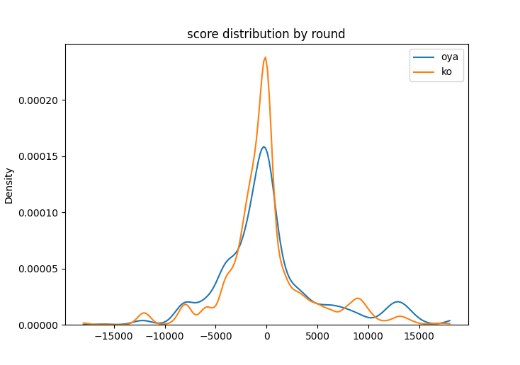

# Mjsoul Statistic Tool

雀魂(https://game.mahjongsoul.com/)上の牌譜データの解析用のツール。


## DEMO

対戦データから集計した局収支の点数分布図



## Features
* Json形式のファイルを時間順に並べ替えて出力 (json_parse.py)
* 点数分布を牌譜データから描画 (score_dist.py)
* Json形式の手牌のシャンテン数を計算 (calc_shanten.py)

## Requirement

* conda(推奨) or pip
* google chrome 
* Tampermonkey
* mahjong_env.ymlファイルに記載

## Installation

```bash
git clone https://github.com/shimyuki32/mjsoul_stat.git
conda env create -n [env_name] -f mahjong_env.yml
```

## Usage
1. Chrome拡張機能 Tampermonkeyをインストールする
https://www.tampermonkey.net/
2. 下記スクリプトdownloadlogs.js をTampermonkeyに登録する
https://gist.githubusercontent.com/Equim-chan/875a232a2c1d31181df8b3a8704c3112/raw/a0533ae7a0ab0158ca9ad9771663e94b82b61572/downloadlogs.js
3. 雀魂牌譜urlを開いてsキーを押し、json形式のファイルをダウンロードする
4. ダウンロードしたファイルをhaihu/ に配置する

サンプルの動かし方
```bash
cd src
python json_parse.py
python score_dist.py
```
## Author
* shimyuki32
* E-mail: shimyuki32@gmail.com
